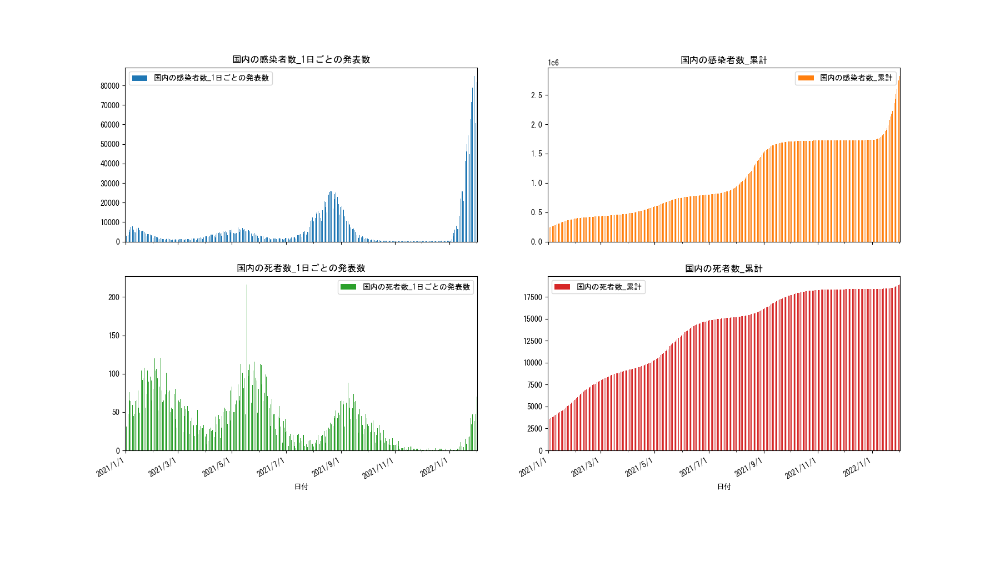

# 日本コロナ情報可視化処理
## 情報源：[NHK](https://www3.nhk.or.jp/news/special/coronavirus/)

## 説明
1.Webスクレイピングでコロナ情報を取得

2.pandasでデータをロードして選択

3.matplotlibでデータ可視化を実現

## パッケージ
```python
import numpy as np
import pandas as pd
import requests
from lxml import etree
from fake_useragent import UserAgent
from japanmap import picture
import matplotlib.pyplot as plt
import matplotlib.dates as mdates
```
## 実行
manage.pyを実行してコマンドで制御する。

## Command
|command|説明|
|:---|:---|
|[info]  | 設定値を確認|
|[load]  | データをロード|
|[range] | 日付範囲を設定 |
|[target]| 日付を設定 |
|[line]  | line graph  を作成|
|[map]   | map graph   を作成|
|[donut] | donut graph を作成|
|[exit]  | 退出 |
|[help]  | Help|

## LineGraph


## MapGraph


## DonutGraph

